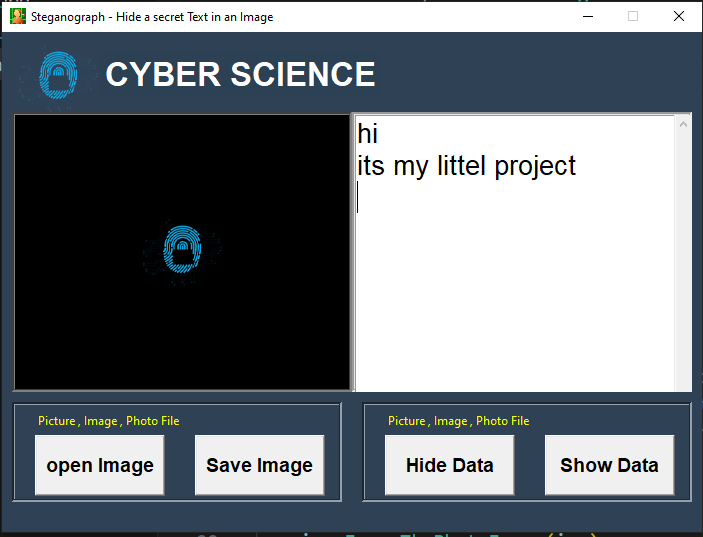

# Steganography - Hide a Secret Text in an Image

🔒 **Steganography** is a Python-based application that enables users to hide and reveal secret text messages within images. Using **Tkinter** for the graphical user interface (GUI) and **Stegano** for implementing the LSB (Least Significant Bit) technique, this application allows secure embedding and extraction of messages within PNG/JPG images.

## 🚀 Features

- 🎨 **Interactive GUI**: Built with Tkinter for ease of use.
- 📷 **Image Handling**: Supports PNG and JPG formats.
- 🔐 **Message Embedding**: Hide a secret text message in an image.
- 🔓 **Message Extraction**: Reveal the hidden message from the image.
- 💾 **Save and Load**: Save images with hidden messages and load them for future use.

## ⚙️ Requirements

- Python 3.x
- Tkinter (usually pre-installed)
- Pillow (`pip install pillow`)
- Stegano (`pip install stegano`)

## 🔧 Installation

1. Clone the repository:

    ```bash
    git clone https://github.com/mian-arham-haroon/steganography-project.git
    ```

2. Install the necessary libraries:

    ```bash
    pip install pillow stegano
    ```

3. Run the application:

    ```bash
    python steganography.py
    ```

## 🖼️ Screenshots

Screenshots are available in the `/screenshots` folder for visual reference of the application’s interface.
[](screenshots/ss.png)

## 💡 Optional Enhancements

- Add password protection for added security.
- Implement multi-message embedding.
- Explore advanced image formats like BMP or GIF.

📌 **Conclusion**: This project is an excellent introduction to **steganography**, **image processing**, and **GUI development** using Python.
